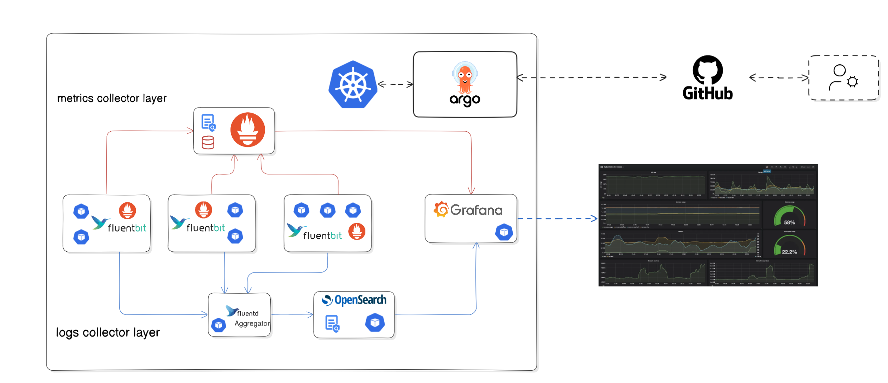
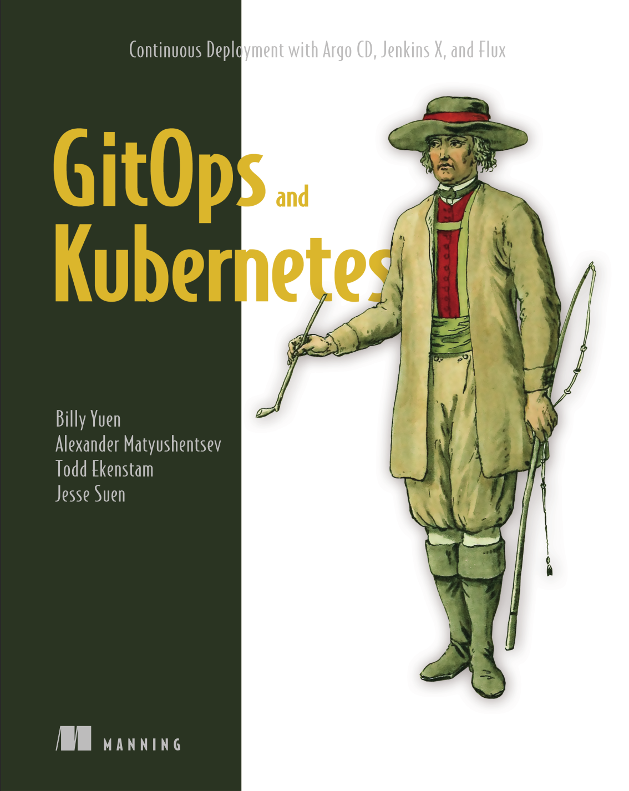

# Monitoring and logging — GitOps README

This repository contains a GitOps-first monitoring and logging stack. It demonstrates metrics collection with Prometheus and log collection with OpenSearch ( Fluentbit, Fluentd). You may choose only one log backend for deployment — OpenSearch (alongside Fluentbit/Fluentd) or Loki (with Promtail) — but the Prometheus charts included here do not install Loki

For a detailed comparison between Loki and OpenSearch stacks, see [this md](argo-cd-doc/diff.md)

---

## Overview

The stack in this repository is organized for GitOps delivery via Argo CD. Metrics are gathered by Prometheus stacks. Logs are gathered by Fluent Bit/Fluentd (Agreggator) and indexed into OpenSearch. Grafana and OpenSearch Dashboards provide visualization and exploration.

## Notice !!!

**Warning:** All credentials in this repository are stored in **plain text**, which is a critical security vulnerability and violates industry best practices. This approach is used solely for home lab demonstration purposes to simplify setup and focus on core concepts.

In production environments, never store secrets in plain text or commit them to version control. Use dedicated secrets management solutions.

# Screenshots and terminal output of the results
    
Argocd ui and running resources

- [Screenshots and terminal output](argo-cd-doc/output.md)

## Official documentation and learning resources

Use these official sites for installation guides, configuration references, and in-depth learning:

- Argo CD — https://argo-cd.readthedocs.io/en/stable/
- Prometheus — https://prometheus.io/docs/
- Grafana — https://grafana.com/docs/
- OpenSearch — https://opensearch.org/docs/
- Fluent Bit — https://docs.fluentbit.io/
- Fluentd — https://docs.fluentd.org/
- Traefik — https://doc.traefik.io/traefik/
- Cloudflared (Cloudflare Tunnel) — https://developers.cloudflare.com/cloudflare-one/connections/connect-apps/
- GitOps and best practices — https://argo-cd.readthedocs.io/en/stable/operator-manual/best_practices/ and https://www.cncf.io/blog/2021/03/01/gitops-the-declarative-approach-to-operating-cloud-native-infrastructure/

## Quick operational checks

- Argo CD shows all apps Healthy and Synced.
- Prometheus: all expected targets are UP and node exporters are visible.
- Fluent Bit / Fluentd: logs are forwarded without dropped records and Fluentd buffer metrics are healthy.
- OpenSearch: indices exist and OpenSearch Dashboards can query them.
- Grafana: dashboards load and display data from Prometheus and OpenSearch as configured.

---

## Why GitOps here — seven guiding principles

Declarative desired state

Store Helm values and Kubernetes manifests in Git. The `apps/` and `apps/charts/` directories contain the desired state so changes are explicit and reviewable.

Versioned and auditable

Every change is a Git commit and PR. Use pinned chart and image versions where possible to make rollbacks and audits reliable.

Single source of truth

Git is the canonical source of cluster configuration. Argo CD reconciles the cluster to match what is declared in this repository.

Pull-based delivery and automated reconciliation

Argo CD (pull model) continuously reconciles cluster state to Git. This reduces the risk of inadvertent pushes and ensures drift is corrected.

Changes via pull requests and automated validation

Make changes through PRs, validate with CI (linting, policy checks, helm template), and require reviews before merging to protect production clusters.

Observe and alert on the control plane

Monitor Argo CD and GitOps workflows with Prometheus so you detect sync failures or drift quickly.

Secure and minimal secrets handling

Never store plaintext secrets in Git. Use SOPS, SealedSecrets, or an external secrets operator to keep sensitive material encrypted and auditable.

These principles are applied across this repo: declarative values, Argo CD for reconcile, CI validation for PRs, and guidance to encrypt secrets.

---

## Read more (local README files)

Follow these README files for chart- and component-specific configuration:

- [kube-prometheus-stack README](apps/charts/prometheus-stack/kube-prometheus-stack/README.md)
- [Grafana chart README](apps/charts/prometheus-stack/kube-prometheus-stack/charts/grafana/README.md)
- [Fluent Bit chart README](apps/charts/fluent-bit-chart/fluent-bit/README.md)
- [Fluentd chart README](apps/charts/fluentd-chart/fluentd/README.md)
- [OpenSearch chart README](apps/charts/opensearch-chart/opensearch/README.md)

---

## apps/ layout and how Argo CD syncs applications

The `apps/` directory contains the GitOps application manifests and Helm value files that Argo CD uses as the source of truth. Typical contents and roles:

- `apps/*.yaml` — top-level Argo CD Application manifests (or app descriptors) that point to charts or folders in this repository.
- `apps/charts/` — packaged or local Helm charts and chart-level `values.yaml` files used by the applications.
- `apps/*-app.yaml` — example application YAMLs that declare `spec.source` (repo, path/chart) and `spec.destination` (cluster/namespace).

### This repository follows the Argo CD "app-of-apps" pattern: a root Argo CD Application (often stored in `argocd-bootstrap/` or at the repo root) deploys child Application manifests found in `apps/`, allowing Argo CD to manage multiple application groups from a single entry point.

How Argo CD discovers and syncs apps

1. Argo CD is configured with this repository (URL + optional path). It reads Application manifests from the repository or is given paths via an "app-of-apps" pattern.
2. Each Application declares a source (git repo URL, path or chart, and chart values) and a destination (cluster and namespace).
3. On a sync, Argo CD pulls the declared source from Git, renders manifests (Helm rendering if applicable), and applies them to the target cluster.
4. Sync policy options: manual or automated sync, `prune` to remove unmanaged resources, and `selfHeal` to automatically revert drift.
5. Health checks and sync waves control ordering and verification; Argo CD shows per-application status (Healthy/Synced) in the UI.

In this repo, look at `apps/prometheus-stack-app.yaml`, `apps/fluentbit-app.yaml`, `apps/fluentd-app.yaml`, and `apps/opensearch-app.yaml` for concrete examples of how sources and destinations are declared.

## Access and networking note

Traefik is installed in this layout to expose Argo CD and other services. The Argo CD UI is accessed using a cloudflared tunnel, which provides secure access without exposing the cluster ingress directly to the public internet.

## Recommended Book:

[GitOps and Kubernetes Continuous Deployment with Argo CD, Jenkins X, and Flux](https://books.google.ro/books?id=SXGezQEACAAJ&printsec=copyright&redir_esc=y#v=onepage&q&f=false)

  

