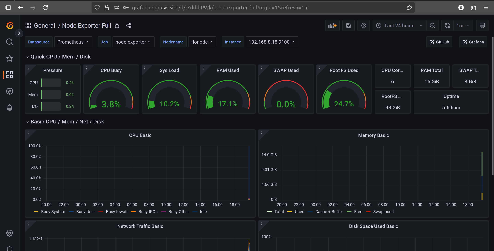

### Screenshots and terminal output

The following images in `argo-cd-doc/` show UI and terminal outputs produced during setup

# Overview ARGOCD UI

# Monitoring Namespace Output:

# Grafana Output: (Node Exporter Dashboard)

# Logging Namespace Output:

# Init:

---